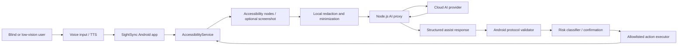

# SightSync

SightSync is an early-stage open-source Android AI accessibility assistant for
blind and low-vision users. It combines an Android `AccessibilityService`, voice
input, text-to-speech feedback, and a small backend AI proxy to read the current
screen, explain what is available, and execute tightly bounded phone actions.

The project is Chinese-first today, with English-facing project documentation
being added so reviewers and contributors can understand the safety model.

## Why This Exists

Mobile accessibility still depends heavily on each app exposing a useful
accessibility tree. SightSync explores a more auditable path for AI-assisted
mobile accessibility: use AI to interpret the current screen, but keep phone
control constrained, visible, interruptible, and locally validated.

The project is intentionally conservative. It is not a hidden hotword listener,
not a free-form autonomous phone agent, and not a place to store cloud provider
keys inside the Android app.

## Current Status

SightSync is a public prototype, not a production accessibility tool.

- License: AGPL-3.0.
- Android app: Kotlin, Jetpack Compose, minSdk 30, targetSdk 35.
- Backend: small Node.js AI proxy with structured protocol validation.
- V1 baseline: permission entry, accessibility service, overlay/notification
  entry points, screen node extraction, privacy explanation, AI proxy protocol,
  action validation, risk classification, and unit/integration tests.
- V2 Phase 1: stability and safety baseline completed in local emulator
  acceptance on 2026-06-11.
- Current public adoption is still small. The repo is being developed in the
  open because the safety, accessibility, and agent-boundary patterns are useful
  to review early.

Acceptance evidence:

- [V1 Phase 6 acceptance checklist](docs/phase6-acceptance.md)
- [V2 speech stability acceptance](docs/v2-speech-acceptance.md)
- [V2 Phase 1 emulator acceptance](generated-docs/acceptance/2026-06-11-phase1-emulator-acceptance.md)

## Safety Model

SightSync's core rule is that AI can suggest, but the Android app remains the
final authority for protocol validation, risk checks, and execution.

Current guardrails:

- Listening starts only after explicit user action.
- Continuous listening must keep a visible foreground notification and floating
  control; the user can stop it from the overlay, notification, or voice command.
- No invisible hotword wakeup and no hidden background recording.
- The Android app does not store real cloud AI provider API keys.
- The backend proxy owns provider credentials and validates structured AI
  responses.
- Screen data follows data minimization: accessibility nodes first, screenshots
  only as a fallback when the approved strategy allows it.
- Sensitive fields such as passwords, verification codes, phone numbers, ID
  numbers, and email-like values are redacted locally before remote processing
  where applicable.
- AI responses must use a structured action protocol; arbitrary scripts, shell
  commands, and free-form execution are rejected.
- Android only executes allowlisted actions such as speaking, clicking a known
  node, setting text, scrolling, back/home, and opening an app.
- High-risk contexts such as payment, deletion, submission, verification codes,
  and passwords require confirmation or are refused by the current phase.
- Installed app names are used locally for open-app matching and are not uploaded
  by default.

The approved project boundary is documented in:

- [V1 product and safety baseline](纲领.md)
- [V2 speech stability design](docs/superpowers/specs/2026-05-18-v2-speech-stability-design.md)
- [V2 boundary update design](docs/superpowers/specs/2026-05-28-v2-boundary-update-design.md)
- [Long-term development plan](SIGHTSYNC_LONG_TERM_PLAN.md)

## Architecture



## Roadmap

The project is moving through small, testable phases:

1. Stability and safety baseline: completed locally on 2026-06-11.
2. Run without a development computer by configuring a personal backend proxy.
3. Improve screen understanding quality with structured summaries.
4. Add low-risk, bounded multi-step tasks with page-state validation.
5. Build repeatable real-device acceptance for common apps and failure modes.

The current long-term plan is tracked in
[SIGHTSYNC_LONG_TERM_PLAN.md](SIGHTSYNC_LONG_TERM_PLAN.md).

## Local Development

Prerequisites:

- Windows PowerShell or equivalent shell.
- JDK 17.
- Android SDK with API 35.
- Node.js for the backend proxy tests.

Run Android unit and source tests:

```powershell
$env:ANDROID_HOME='D:\AndroidDev\Sdk'
$env:ANDROID_SDK_ROOT=$env:ANDROID_HOME
.\gradlew.bat :app:testDebugUnitTest
```

Build a debug APK:

```powershell
.\gradlew.bat :app:assembleDebug
```

Install on a local emulator or device:

```powershell
.\gradlew.bat :app:installDebug
```

Run backend tests:

```powershell
cd backend
npm test
```

Run the backend proxy locally:

```powershell
cd backend
$env:APP_API_TOKEN='dev-token'
$env:QWEN_API_KEY='<provider-key-kept-on-backend-only>'
npm start
```

The Android app talks to the proxy. Do not put real provider keys in Android
source files, Gradle files, checked-in docs, or issue attachments.

## Contributing

Contributions are welcome if they preserve the accessibility and safety
boundaries above. Start with [CONTRIBUTING.md](CONTRIBUTING.md), then read
[AGENTS.md](AGENTS.md) and the V2 specs before changing Android behavior.

For security or privacy-sensitive reports, read [SECURITY.md](SECURITY.md)
before opening a public issue.
